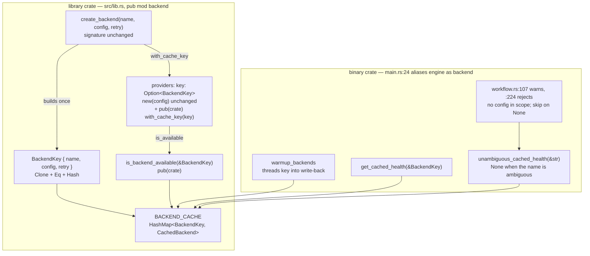

# CLO-653: Key BACKEND_CACHE on configuration, not name alone

**Linear Task**: https://linear.app/cloud-ai/issue/CLO-653
**Status**: Design
**Author**: Max
**Created**: 2026-08-07

---

## Summary

`BACKEND_CACHE` memoizes constructed backends by name alone, so the second consumer in a process asking for `"ollama"` with a different configuration silently receives the first consumer's instance. This design replaces the `String` key with an owned `BackendKey { name, config, retry }`, gives each provider the key it was cached under so `is_available` can find itself, and fixes the warmup write-back that would otherwise diverge from its own read key and quietly break health probing.

`create_backend` keeps its signature. The public break covers three items plus one behavioural change. The crate *is* published — 28 versions — but no published version has a library target, so none of the broken surface has ever shipped.

---

## Background

The library extraction (CLO-589 → CLO-593) existed to let remem-ai and gcm stop re-implementing the same LLM abstraction. Two consumers in one process is precisely that case, and it is the case this defect breaks. The failure mode is the worst kind: a wrong answer from a call that succeeds.

CLO-591 left the fix open deliberately and it was recorded as a standing constraint in `docs/DEPENDENCIES.md` rather than as an issue, which is why no backlog view surfaced it until now. `acquire_test_lock` (`src/backend/mod.rs:641`) exists as a compensating control for the same root cause.

### Prior Research

`docs/discovery/clo-653.md` (baseline 6/10, four approaches, zero killer assumptions). Four findings from reading the call sites changed the shape of the work from what the ticket describes:

1. **Eight production name-keyed sites, not two.** The ticket names `is_backend_available` twice; `src/engine.rs:178` is `#[cfg(test)]`.
2. **`main.rs:24` is `pub(crate) use crate::engine as backend;`** — the library is only `pub mod backend;`, so `engine.rs`, `workflow.rs` and `conductor.rs` are binary-only. This narrows the public break to two items.
3. **Providers retain no `BackendConfig`.** `OllamaBackend` is `{ client, base_url, model }`. `is_available` cannot compute a key from what it holds.
4. **`RetryPolicy` must be in the key.** It comes from `config.defaults` via `get_retry_policy`, which is not part of `BackendConfig`, and it decides whether the instance is `RetryExecutor`-wrapped.

Approach C (a host-owned `BackendCache` handle) was deferred rather than rejected. The decisive argument is that it is a superset of this work, not an alternative: a host-owned cache still needs config-aware keying inside it, or the same bug reappears per handle whenever one host builds two configs.

---

## Architecture

### Component Overview



### Affected Components

| Component | Change Type | Description |
|---|---|---|
| `backend/config.rs` | Modified | Derive `PartialEq, Eq, Hash` on `BackendConfig` |
| `backend/retry.rs` | Modified | Derive `PartialEq, Eq, Hash` on `RetryPolicy` |
| `backend/mod.rs` | Modified | `BackendKey`; cache map type; `create_backend` key construction and double-checked insert; `is_backend_available` takes a key; `set_mock_health` takes a key; rustdoc |
| `backend/{ollama,codex,claude,gemini,bedrock}.rs` | Modified | `key: Option<BackendKey>` field, `with_cache_key` builder, `is_available` uses the key |
| `engine.rs` | Modified | `warmup_backends` key threading; `get_cached_health` takes a key; `Engine::is_backend_available` test helper |
| `workflow.rs` | Modified | Two name-only health reads move to `unambiguous_cached_health` and skip their check when it answers `None` |
| `main.rs` | Modified | `:795` builds a key for `get_cached_health` |
| `lib.rs` | Modified | Remove the name-only constraint from the crate docs |
| `docs/DEPENDENCIES.md` | Modified | Retire the standing-constraint bullet |

### Dependencies

- **Internal**: `Config::defaults` feeds `get_retry_policy`, so the key depends on `config.rs` as well as `backend/config.rs`.
- **External**: None. No new crates.

---

## Detailed Design

### Implementation Approach

Build the key once at the top of `create_backend` and use that single value for the cache read, the provider attachment, and the insert. Every other site derives the same key from the same inputs, so identity is computed one way everywhere.

Keying on owned values rather than a `u64` digest is deliberate. A digest collision would silently return the wrong instance, which is exactly the bug under repair and strictly harder to detect afterwards, because the cache would then look correct by construction. It also makes the ticket's "stable across runs" requirement moot — that requirement does not apply to an in-memory cache in the first place.

### Code Structure

```rust
// src/backend/mod.rs

/// Identity a backend instance is cached under.
///
/// Two callers that build the same backend name with equal configuration and
/// equal retry policy share one instance; any difference in either yields a
/// distinct instance. `RetryPolicy` participates because it is derived from
/// `Config::defaults` rather than from `BackendConfig`, and it decides whether
/// the cached value is wrapped in a [`RetryExecutor`].
#[derive(Clone, Debug, PartialEq, Eq, Hash)]
pub struct BackendKey {
    name: String,
    config: BackendConfig,
    retry: RetryPolicy,
}

impl BackendKey {
    /// Takes `retry` by reference and clones internally. `RetryPolicy` is not
    /// `Copy`, and every caller reads it again after building the key.
    pub fn new(name: &str, config: &BackendConfig, retry: &RetryPolicy) -> Self { /* ... */ }
    pub fn name(&self) -> &str { &self.name }
}

pub static BACKEND_CACHE: OnceLock<RwLock<HashMap<BackendKey, CachedBackend>>> = OnceLock::new();

pub(crate) fn is_backend_available(key: &BackendKey) -> bool { /* unchanged body, keyed lookup */ }

// NOTE: this lives in the binary crate (`engine.rs`), not in the library.
// Both callers are in `workflow.rs`, which is binary-only, so putting it in
// `backend` would enlarge the published library surface for no consumer.

/// Health for `name` **only when exactly one configuration of it is cached**.
///
/// Returns `None` when no entry matches and, deliberately, also when more than
/// one does. Callers must treat `None` as "cannot answer" and skip the
/// cache-based check rather than guessing — see `unambiguous` in the name.
///
/// Never use this to select an instance. Use the [`BackendKey`] the caller
/// passed to `create_backend`.
fn unambiguous_cached_health(name: &str) -> Option<HealthStatus> { /* ... */ }
```

Providers keep their public constructors and gain a builder:

```rust
// each of ollama.rs, codex.rs, claude.rs, gemini.rs, bedrock.rs
pub struct OllamaBackend {
    client: Client,
    base_url: String,
    model: String,
    key: Option<BackendKey>,
}

impl OllamaBackend {
    pub fn new(config: &BackendConfig) -> Result<Self> { /* unchanged, key: None */ }

    /// Attach the cache identity this instance was constructed under.
    ///
    /// Crate-internal on purpose. A public setter would let any caller stamp one
    /// instance with another entry's identity and read that entry's health back
    /// through `is_available`.
    pub(crate) fn with_cache_key(mut self, key: BackendKey) -> Self { self.key = Some(key); self }
}

fn is_available(&self) -> bool {
    self.key.as_ref().is_some_and(|k| super::is_backend_available(k))
}
```

`Option<BackendKey>` rather than a required constructor argument, because `new(config)` is public API re-exported at the crate root, `create_claude_backend` (`engine.rs:19-25`) calls `ClaudeBackend::new` directly, and roughly fifteen unit tests construct providers by hand. An instance built outside `create_backend` is not in the cache, so `is_available() == false` is the honest answer rather than a degraded one.

Verified that no production caller depends on the old behaviour: both `create_claude_backend` consumers (`conductor.rs:74`, `spawn.rs:74`) use `api_details()` and never call `is_available()`. The two production `is_available()` calls, `engine.rs:225` and `engine.rs:432`, both operate on instances that came straight out of `create_backend` and are therefore keyed. The affected sites are test-only: the `MockSyscallBackend` at `engine.rs:1115` and the `set_mock_health` helper, both of which write and read the cache by bare name. `set_mock_health` is migrated in Phase 2 alongside the map type, since it is public under `test-support` and its signature is part of the break; `MockSyscallBackend` follows in Phase 4 with the other test helpers.

The key is cloned into both the map and the provider, so a config's `Vec<String> args` is held twice. Negligible at this scale. If it ever matters, `Arc<BackendConfig>` inside `BackendKey` preserves `Eq` and `Hash` and removes the duplication without changing anything else in this design.

`create_backend` keeps its signature — all nine production callers already hold both `backend_config` and `retry_policy`:

```rust
use std::collections::hash_map::Entry;

pub fn create_backend(name: &str, config: &BackendConfig, retry_policy: RetryPolicy)
    -> Result<Arc<dyn Backend>>
{
    // Borrow, do not move: retry_policy is read again below and is not Copy.
    let key = BackendKey::new(name, config, &retry_policy);

    // Bind the guard to a local in its own scope, matching the existing code.
    // Chaining `.read().expect(..).get(&key)` inside an `if let` keeps the guard
    // alive for the whole block on the 2021 edition.
    {
        let cache = get_backend_cache();
        let lock = cache.read().expect("backend cache lock poisoned");
        if let Some(entry) = lock.get(&key) {
            return Ok(Arc::clone(&entry.backend));
        }
    }

    let inner: Arc<dyn Backend> = match name {
        "ollama" => Arc::new(ollama::OllamaBackend::new(config)?.with_cache_key(key.clone())),
        // ... same shape for codex, gemini, claude, bedrock
    };

    let candidate = if retry_policy.max_retries > 0 { /* RetryExecutor */ } else { inner };

    // Double-checked insert: never clobber an entry that may already hold a probe.
    let cache = get_backend_cache();
    let mut lock = cache.write().expect("backend cache lock poisoned");
    Ok(match lock.entry(key) {
        Entry::Occupied(e) => Arc::clone(&e.get().backend),
        Entry::Vacant(e) => {
            e.insert(CachedBackend { backend: Arc::clone(&candidate), health: None, checked_at: None });
            candidate
        }
    })
}
```

`RetryExecutor::is_available` (`retry.rs:146`) already delegates to its inner backend, so the wrapper needs no key of its own.

### Hashability — enumerated and compile-verified

The AI review flagged this as the one item that could derail Phase 2, reasoning that LLM provider configs usually carry `f64` sampling fields (`temperature`, `top_p`) which implement neither `Eq` nor `Hash`. That reasoning does not apply here: `BackendConfig` is a process and endpoint config, not a sampling config. The full field set:

| Type | Field | Rust type | `Eq + Hash`? |
|---|---|---|---|
| `BackendConfig` | `enabled` | `bool` | yes |
| | `command` | `Option<String>` | yes |
| | `args` | `Vec<String>` | yes |
| | `skip_lines` | `usize` | yes |
| | `api_key_env` | `Option<String>` | yes |
| | `model` | `Option<String>` | yes |
| | `timeout` | `Option<Duration>` | yes |
| | `max_retries` | `Option<usize>` | yes |
| | `retry_delay_ms` | `Option<u64>` | yes |
| `RetryPolicy` | `max_retries` | `usize` | yes |
| | `base_delay` | `Duration` | yes |
| | `max_delay` | `Duration` | yes |

No floats in either type. The only `f64` nearby is a local in the jitter calculation at `retry.rs:52`, not a field.

Verified rather than asserted: both derives were added temporarily, `cargo check --all-targets` and `cargo check --all-targets --features bedrock` both compiled clean, and the change was reverted. No `ordered_float` wrapper, quantization, or hand-written `Hash` impl is needed.

### Concurrent construction must not erase probed health

`create_backend` drops the read guard before constructing and takes the write guard afterwards, so two callers that miss on the same key can both construct. An earlier draft of this design called the outcome safe on the grounds that equal keys imply equivalent instances. That reasoning covers the `backend` field and misses the rest of the entry.

`CachedBackend` also carries mutable health state. `create_backend` writes `health: None, checked_at: None` unconditionally (`mod.rs:399-407`); `warmup_backends` writes `health: Some(status)` (`engine.rs:154-163`). So the interleaving below loses a completed probe:

| | Thread A (slow construct, e.g. bedrock) | Thread B |
|---|---|---|
| 1 | read miss on `key` | |
| 2 | constructing… | read miss on `key`, constructs, inserts `health: None` |
| 3 | constructing… | probes; warmup inserts `health: Some(available)` |
| 4 | inserts `health: None` — **probe erased** | |

The entry now claims unprobed. `is_available` returns false for a backend that is up, and `warmup_backends` re-probes something it already probed. Nothing errors.

The fix keeps construction outside the lock and makes the write conditional:

```rust
// construct outside any lock, as today
let candidate = /* provider, optionally RetryExecutor-wrapped */;

let mut lock = get_backend_cache().write().expect("backend cache lock poisoned");
match lock.entry(key) {
    // Someone won the race. Their instance is equivalent to ours by key equality,
    // and their entry may already carry a probe ours would destroy. Keep theirs.
    Entry::Occupied(e) => Arc::clone(&e.get().backend),
    Entry::Vacant(e) => {
        e.insert(CachedBackend { backend: Arc::clone(&candidate), health: None, checked_at: None });
        candidate
    }
}
```

This is strictly better than the `entry().or_insert_with(...)` an earlier draft rejected: the closure form would hold the write lock across construction, including the bedrock arm's `block_in_place`, whereas inserting an already-built value holds it only for the map operation. The earlier rejection conflated the two.

Note that `set_mock_health` (`mod.rs:495-504`) already uses exactly this shape — `entry().and_modify().or_insert()` — to update health without discarding the cached backend. The production path should match the helper that was written to be careful about it.

Regression test: two threads racing `create_backend` on one key, with a probe landing between them, must leave `health: Some(..)` intact and return the same `Arc` to both.

### What the key does not capture: ambient construction inputs

`BackendKey` captures the declared configuration. Two providers read process-ambient state at construction that the key cannot see:

- `ClaudeBackend::new` resolves `config.api_key_env` to a variable *name*, then reads `env::var(&api_key_env)` and stores the resulting `SecretString` (`claude.rs:86-104`). The key holds the name; the value is invisible to it.
- `BedrockBackend::new` calls `aws_config::load_defaults(BehaviorVersion::latest())` (`bedrock.rs:99`), picking up the ambient AWS profile, region and credential chain. None of that is in the key.

So two consumers with byte-identical `BackendConfig` but different `ANTHROPIC_API_KEY` values, or different `AWS_PROFILE`, still share one instance carrying whichever credentials were live at first construction. That is the same class of silent-wrong-answer this ticket exists to fix, narrowed to credentials.

This is a documented bound, not a fix. Hashing a resolved secret would put credential material in a map key and in `Debug` output, which is worse than the problem. The honest options are for the host to use distinct `api_key_env` names per tenant — which *is* in the key and therefore works today — or to own separate caches, which is Approach C. Both are recorded in the rustdoc so an embedding host learns it from the API rather than from a surprise.

### Cache growth bound

Name keying bounded the cache at the provider count — five. Config keying bounds it at the number of distinct `(name, config, retry)` triples the process sees.

For the CLI this is still effectively five: configs come from a static `lok.toml` resolved once per run. For an embedding host the bound is however many distinct configurations it builds, which is the entire point of the change. The pathological case is a host that mints a fresh config per request, for instance by varying `model` per call, which would grow the map without limit. That is accepted and documented rather than guarded: adding eviction would mean choosing a policy that interacts with the health-probe TTL, which is a larger design than this ticket. If it becomes real, the host-owned cache handle of Approach C is the natural place to solve it, since a host that owns its cache can drop it.

### The warmup write-back — the one site that fails silently

`warmup_backends` reads at `engine.rs:100` using the config map key but writes back at `engine.rs:161` using `backend.name()`. Those are the same string today and diverge the moment the key carries configuration: warmup would insert a second entry and `is_available` would never observe a probe. That is the precise mechanism by which this change could break the health-probe layer the ticket asks to preserve.

The fix is to move the key into the future instead of recovering a name from the backend:

```rust
let key = BackendKey::new(name, backend_config, retry_policy);
match create_backend(name, backend_config, retry_policy) {
    Ok(backend) => futures.push(async move {
        let res = backend.health_check().await;
        (key, Arc::clone(&backend), res)   // was: backend.name().to_string()
    }),
    Err(e) => { /* unchanged */ }
}
```

Error and warning messages use `key.name()`, so operator-visible output is unchanged. The skip-check at `engine.rs:100` uses the same `key`.

### The two config-free reads — and why only one is a diagnostic

`workflow.rs:107` (`codex_unusable_flag_warnings(step)`) and `workflow.rs:224` (hardcoded `lock.get("ollama")` for model validation) both sit under `Workflow::validate(&self)`, which takes no `Config` and is called from `load_workflow_from_source_with_depth` — itself config-free and recursive through `extends`. Threading a `Config` down that path would be a substantial signature change to workflow loading.

An earlier draft called both of these "diagnostics only". That is true of the Codex site, which only pushes strings that the caller prints as warnings. **It is false of the Ollama site**, which returns a hard error and rejects the workflow:

```rust
// src/workflow.rs:237
return Err(WorkflowError::UnknownModel { workflow, step, backend, model });
```

That distinction decides the design. An arbitrary-match helper on a control-flow path that rejects user workflows can, with two healthy Ollama configurations cached, do both of the following depending on `HashMap` iteration order:

- reject a model that *is* present on the endpoint the step will actually use
- accept a model that is *absent* from it, deferring the failure to runtime

The earlier "prefer a probed-available entry" refinement makes this worse rather than better: it actively steers the lookup toward a healthy configuration that may not be the one the step runs against.

So both sites use `unambiguous_cached_health(name)`, which answers only when exactly one configuration of that name is cached and returns `None` otherwise. Each caller treats `None` as "cannot answer":

- **Ollama model validation** skips the check entirely and lets the step run. Failing open matches today's behaviour whenever the cache has no entry, and a runtime error from the real endpoint is strictly better than a validation error naming the wrong one.
- **Codex flag warnings** emit nothing, because a warning derived from an arbitrary configuration is worse than silence.

For the CLI nothing changes: configs come from one `lok.toml`, so exactly one configuration per name is ever cached and the helper always answers. Ambiguity is reachable only by an embedding host, which is the case this ticket introduces.

Threading the real `BackendKey` into validation stays the correct long-term answer, and it becomes natural under Approach C where the host owns its cache. It is out of scope here because it means passing `Config` through workflow loading and its `extends` recursion.

### API/Interface Design

| Item | Before | After | Break? |
|---|---|---|---|
| `backend::BACKEND_CACHE` | `HashMap<String, CachedBackend>` | `HashMap<BackendKey, CachedBackend>` | **yes** — public, documented |
| `backend::get_backend_cache` | returns the `String`-keyed map | returns the `BackendKey`-keyed map | **yes** — public |
| `backend::set_mock_health` | `(&str, HealthStatus)` | `(&BackendKey, HealthStatus)` | **yes** — public under `test-support`, which `lib.rs:71` advertises as "used internally and by downstream test suites" |
| `*Backend::is_available` | true once the name was probed | false unless the instance was built through `create_backend` | **behavioural** — affects hand-built providers |
| `backend::BackendKey` | — | new public type | additive |
| `backend::create_backend` | `(&str, &BackendConfig, RetryPolicy)` | unchanged | no |
| `OllamaBackend::new` and the other four | `(&BackendConfig)` | unchanged | no |
| `*Backend::with_cache_key` | — | new, **`pub(crate)`** | not public |
| `backend::is_backend_available` | `(&str)` | `(&BackendKey)` | no — `pub(crate)` |
| `engine::get_cached_health` | `(&str)` | `(&BackendKey)` | no — binary-only |
| `engine::unambiguous_cached_health` | — | new, binary-only | not public |

Three signature-level breaks and one behavioural change, not the two an earlier draft claimed.

`with_cache_key` is `pub(crate)`, corrected from public. A public builder would let any caller stamp one instance with another's identity and read that entry's health through `is_available` — forging a health answer. It is internal plumbing for `create_backend` and nothing outside the crate has a reason to call it.

`unambiguous_cached_health` lives in `engine.rs` rather than `backend`, since both callers are in binary-only `workflow.rs`. Putting it in the library would grow the published surface for no consumer.

### Publication status — corrected

An earlier draft asserted the crate "has never been published" and rested the whole semver argument on it. **That is false.** `cargo search lokomotiv` returns `20260208.0.2`, the crates.io versions API lists **28 published versions** between 2026-01-25 and 2026-02-08, and none are yanked. `docs.rs/crate/lokomotiv/20260208.0.2` returns HTTP 200.

The conclusion survives, but for a narrower and checkable reason. `docs.rs` reports `lokomotiv-20260208.0.2 is not a library`, and `git log -S'[lib]'` dates the `[lib]` target and `pub mod backend` to `d828890`, **2026-07-26** (CLO-593) — five months after the last publish. No published version carries a library target, so `BACKEND_CACHE` has never appeared in a published API and breaking it now breaks no published consumer.

The deadline is nonetheless real and sharper than "someday". The project shipped 28 versions in a fortnight in early 2026, so the first release carrying the library surface could go out at any time, and `cargo yank` does not delete a version — a published `BACKEND_CACHE` type is permanent. Do this before the next publish.

Three repository documents still describe the crate as unpublished — `docs/ROADMAP.md` Phase 13 "Release Readiness", the `docs/DEPENDENCIES.md` standing-constraints note, and CLO-609's "pre-publish metadata deadline". That inconsistency is what produced the false claim here and is filed separately; it is not fixed by this ticket.

---

## Implementation Plan

### Phase 1: Failing test first

- [ ] Stand up a local recording HTTP server fixture (two ports) usable from `backend` tests
- [ ] Add `two_configs_same_name_honour_their_own_endpoint_and_model` — build `"ollama"` twice against different servers with different models, call `query` on each, assert each server received exactly its own request
- [ ] Confirm it **fails** against current `main`, with both requests arriving at the first server. A pointer-inequality assertion would not have proved the property, so the failure mode must be the observed traffic

### Phase 2: The key

- [ ] Derive `PartialEq, Eq, Hash` on `BackendConfig` (`config.rs:10`) and `RetryPolicy` (`retry.rs:19`)
- [ ] Add `BackendKey` with `new(&str, &BackendConfig, &RetryPolicy)` and a `name` accessor
- [ ] Change the `BACKEND_CACHE` map type and `get_backend_cache`'s return type
- [ ] Build the key once in `create_backend`; use it for read, attachment and insert
- [ ] Convert the insert to the double-checked `entry()` form so a losing racer discards its candidate instead of clobbering
- [ ] Migrate `set_mock_health` to take a `&BackendKey`

### Phase 3: Provider identity

- [ ] Add `key: Option<BackendKey>` and a `pub(crate) with_cache_key` to all five providers
- [ ] Point each `is_available` at the key
- [ ] Change `is_backend_available` to take `&BackendKey`
- [ ] Re-confirm at implementation time that no production caller expects `is_available() == true` on a hand-built provider — done once at design time, worth repeating against the tree as it lands

### Phase 4: Binary-side call sites

- [ ] Thread the key through `warmup_backends`, read and write-back
- [ ] `get_cached_health(&BackendKey)`; `main.rs:795` builds the key from `backend_config` and `config.defaults`
- [ ] Add `unambiguous_cached_health` in `engine.rs` (binary-only, not in the library surface)
- [ ] Move `workflow.rs:107` and `workflow.rs:224` onto it, with each caller skipping its check when the answer is `None`
- [ ] Update `Engine::is_backend_available` and `assert_probed` test helpers

### Phase 5: Documentation

- [ ] Remove the name-only constraint from `lib.rs:73-79`
- [ ] Rewrite the `create_backend` caching rustdoc (`mod.rs:344-353`) and the `BACKEND_CACHE` known-constraint block (`mod.rs:420-430`)
- [ ] Document the deferred host-owned-handle decision, and note that `acquire_test_lock` stays because the global stays
- [ ] Document the ambient-credential bound on `BackendKey` and in the crate docs, with the `api_key_env`-per-tenant workaround
- [ ] Document the `set_mock_health` signature change for `test-support` consumers
- [ ] Retire the `BACKEND_CACHE` bullet in `docs/DEPENDENCIES.md` standing constraints

### Phase 6: Testing and validation

Mirror the required `CI Gate` contract in `.github/workflows/ci.yml` rather than a reduced subset. This change touches the library core and its public types, so the no-default-features and rustdoc legs are load-bearing, not incidental — `BackendKey` and its methods are new public items and `-D missing_docs` will reject them undocumented.

- [ ] `cargo fmt --check`
- [ ] `cargo clippy --locked --all-targets -- -D warnings` (ci.yml:46)
- [ ] `cargo test --locked` (ci.yml:49)
- [ ] `cargo clippy --locked --all-targets --features bedrock -- -D warnings` (ci.yml:54)
- [ ] `cargo test --locked --features bedrock` (ci.yml:57)
- [ ] `cargo build --locked --lib --no-default-features` (ci.yml:179)
- [ ] `cargo test --locked --lib --no-default-features` (ci.yml:210)
- [ ] `cargo clippy --locked --lib --tests --no-default-features -- -D warnings` (ci.yml:213)
- [ ] `RUSTDOCFLAGS='-D missing_docs' cargo doc --locked --no-deps --lib --all-features` (ci.yml:219)
- [ ] MSRV 1.83: `cargo check --locked --all-targets` on the pinned toolchain (ci.yml:87)
- [ ] Bedrock MSRV 1.88: `cargo check --locked --all-targets --features bedrock` (ci.yml:93)
- [ ] `cargo test --test backend_public_api` — the external-consumer surface
- [ ] Extend `tests/backend_public_api.rs` to construct a `BackendKey`, reach the cache through `get_backend_cache`, and call `set_mock_health` in its new form, so all three migrations are proven from outside the crate
- [ ] Measure the `create_backend` key-hashing cost with `cargo bench` or a timed loop over 10k calls; treat >5% of `create_backend` wall time as the threshold that justifies hoisting the key at call sites. Record the number either way

---

## Constraints

**Must**:
- The failing test in Phase 1 must be observed failing against current `main` before Phase 2 begins, and must fail on *configuration*, not on pointer identity
- Warmup must leave exactly one cache entry per configured backend, with `health.is_some()`
- A cache write must never replace an entry holding `health: Some(..)` with `health: None`
- Every cache read and write must derive its key through `BackendKey::new`, never by assembling one inline
- `create_backend` keeps its current signature
- A name-only health read must refuse to answer when the name is ambiguous, rather than pick

**Must-not** (additions):
- Must not use a name-only health read to decide `WorkflowError::UnknownModel`, which rejects user workflows
- Must not expose `with_cache_key` publicly — it would let a caller forge another entry's health identity

**Must-not**:
- Must not use a hash digest as the key — a collision reproduces the defect being fixed
- Must not block the tokio runtime; the existing `block_in_place` in the bedrock arm stays as-is
- Must not change `*Backend::new(config)` signatures — they are public and called directly in `engine.rs:24` and throughout the unit tests
- Must not use `unambiguous_cached_health` to select an instance; it answers about health only, and only when unambiguous

**Accepted**:
- Two callers missing on the same key may both construct. The loser's instance is discarded rather than written, so a redundant construction is wasted but no cache state is lost
- Cache size is bounded by distinct configurations rather than by provider count. Still five for the CLI; unbounded in principle for a host that mints a config per request. No eviction, because a policy would have to interact with the health-probe TTL
- Ambient construction inputs — the resolved value behind `api_key_env`, and Bedrock's AWS environment — are outside the key, so instances are shared across differing credentials. Documented in rustdoc; the host-side answer is distinct `api_key_env` names, which the key does capture
- Ollama model validation and Codex flag warnings become no-ops when a name has more than one cached configuration. Fail-open, matching today's behaviour for an unprobed cache

**Prefer**:
- Owned values over digests wherever the cost is bounded
- Leaving `acquire_test_lock` in place; the global remains, so the compensating control still earns its keep

**Escalate when**:
- The `Backend` trait itself needs a new method (the `with_cache_key` builder is designed to avoid this)
- The public break turns out to reach past `BACKEND_CACHE` and `get_backend_cache`
- `workflow.rs` needs `Config` threaded into `validate()` after all

---

## Acceptance Criteria

- [ ] Two consumers requesting one backend name with different configs each get an instance honouring their own config, proven by observed request traffic rather than by pointer inequality
- [ ] A test demonstrates this and is confirmed failing against pre-change `main`
- [ ] `is_backend_available` reports on the same identity the cache keys on, at every call site
- [ ] Concurrent construction on one key cannot replace `health: Some(..)` with `health: None`
- [ ] A name-only health read returns `None` when the name is ambiguous, and both `workflow.rs` callers skip their check on `None`
- [ ] Health probing and warmup are unchanged for the single-consumer case
- [ ] `src/lib.rs` and `src/backend/mod.rs` no longer describe the name-only constraint, and both document the ambient-credential bound
- [ ] `docs/DEPENDENCIES.md` no longer lists it as a standing constraint
- [ ] `tests/backend_public_api.rs` exercises `BackendKey`, `get_backend_cache` and `set_mock_health` in their new forms
- [ ] Every command in the Phase 6 list passes, including the no-default-features legs, `-D missing_docs`, and both MSRV checks

**Verification method**: run the full Phase 6 list. It mirrors the required `CI Gate` in `.github/workflows/ci.yml`; a reduced local subset is not evidence for this change, because the no-default-features and `missing_docs` legs are the ones most likely to catch new public items.

---

## Evaluation

Pointer inequality is deliberately **not** the proof for test 1. `OllamaBackend`'s `base_url` and `model` are private with no accessor, so two distinct `Arc`s show distinct allocation and say nothing about which configuration each honours — the property under test. Tests 1 and 2 therefore observe behaviour through a local HTTP server rather than through identity.

| # | Test | Proof mechanism | Expected Result |
|---|---|---|---|
| 1 | Same name, different `model` | Two `wiremock`/`hyper` servers on distinct ports, each recording the requests it receives | Each instance's `query` reaches *its own* endpoint carrying *its own* model in the request body. **Must be observed failing before the change**, where both calls hit the first server |
| 2 | Same name, same endpoint, different `model` | One server recording request bodies | Two recorded requests carrying different `model` values. Isolates model from endpoint, so test 1 cannot pass by URL alone |
| 3 | Same `BackendConfig`, different `defaults.max_retries` | Server returning 500 a fixed number of times, counting attempts | Observably different attempt counts — proves retry behaviour differs, not merely that pointers do |
| 4 | Concurrent construction with a probe in between | Two threads racing `create_backend` on one key; a probe lands between them | `health` stays `Some(..)`; both threads receive the same `Arc`. Guards the erase-the-probe defect |
| 5 | Warmup over a normal config | Cache inspection | Exactly one entry per configured backend, each with `health.is_some()`. Guards the write-back key divergence |
| 6 | `is_available` after warmup | Provider call | `true` for a config-keyed entry — proves provider key wiring reaches the probe |
| 7 | Provider built via `new()` alone | Provider call | `is_available() == false`; not in the cache |
| 8 | `unambiguous_cached_health` with one config cached | Helper call | Returns that entry — CLI behaviour preserved |
| 9 | `unambiguous_cached_health` with two configs cached | Helper call | Returns `None` regardless of insertion order or health, run repeatedly to defeat `HashMap` ordering |
| 10 | Two healthy Ollama configs with different model inventories | `Workflow::validate` | Validation is **skipped**, not decided arbitrarily. No `UnknownModel` error either way |

**Edge cases to cover**:
- Cache cleared between `create_backend` and the warmup write-back — the write-back must still land
- `health: None` versus `Some(unavailable)` — the deliberate "not probed" versus "probed and unavailable" distinction at `mod.rs:399-401` must keep working, since `warmup_backends` relies on it to know what still needs a probe
- Bedrock behind its feature flag, where construction is async inside `block_in_place`
- Two configs differing only in a field that does not reach the constructed instance (for example `skip_lines`) — still distinct entries, which is correct if slightly conservative
- Same `BackendConfig` and same key, different ambient `ANTHROPIC_API_KEY` — instances are shared and the first secret wins. Assert the documented behaviour so the bound is pinned rather than discovered later

---

## Testing Strategy

- **Unit tests**: the six above, in `src/backend/mod.rs` and `src/engine.rs` tests. All take `acquire_test_lock`, matching the existing convention.
- **Integration tests**: `tests/backend_public_api.rs` exercises `lokomotiv::create_backend` and must keep compiling unchanged — that is the evidence the signature stayed put.
- **Manual testing**: `cargo run -- doctor` before and after; the health table must be byte-identical, since `main.rs:795` is a rekeyed path and any difference means the key was built wrong.

---

## Open Questions

- [x] How `workflow.rs:107` and `workflow.rs:224` identify entries with no config in scope — resolved: `unambiguous_cached_health`, which refuses to answer when the name is ambiguous, with both callers skipping their check on `None`
- [x] Whether providers take the key by constructor or builder — resolved: builder, keeping `new(config)` public and unchanged
- [x] Whether `RetryPolicy` belongs in the key — resolved: yes
- [x] Whether `BackendConfig` and `RetryPolicy` can derive `Eq + Hash` — resolved: yes, enumerated and compile-verified both with and without the `bedrock` feature
- [x] Whether any production caller relies on `is_available()` being true for a hand-built provider — resolved: none does
- [x] Whether the crate is published — resolved: yes, 28 versions, none yanked. No published version has a library target, which is why the break is still affordable
- [x] Whether a name-only health read is safe on the Ollama path — resolved: no, it decides a hard `UnknownModel` error. Refuse to answer when ambiguous
- [x] Whether concurrent construction is benign — resolved: no, the losing racer's `health: None` erases a probe. Double-checked insert
- [ ] Whether the key-hashing cost on `create_backend` is measurable. Now a Phase 6 obligation with a stated method and a >5% threshold rather than an open question. Hoisting the key at call sites is the fix if it trips, and needs no design change since all nine callers already hold the inputs

---

## References

- [Linear CLO-653](https://linear.app/cloud-ai/issue/CLO-653)
- [Discovery report](../discovery/clo-653.md)
- [CLO-589 crate-shape ADR](../adrs/clo-589-backend-library-shape.md)
- [CLO-591](https://linear.app/cloud-ai/issue/CLO-591) — left this open deliberately
